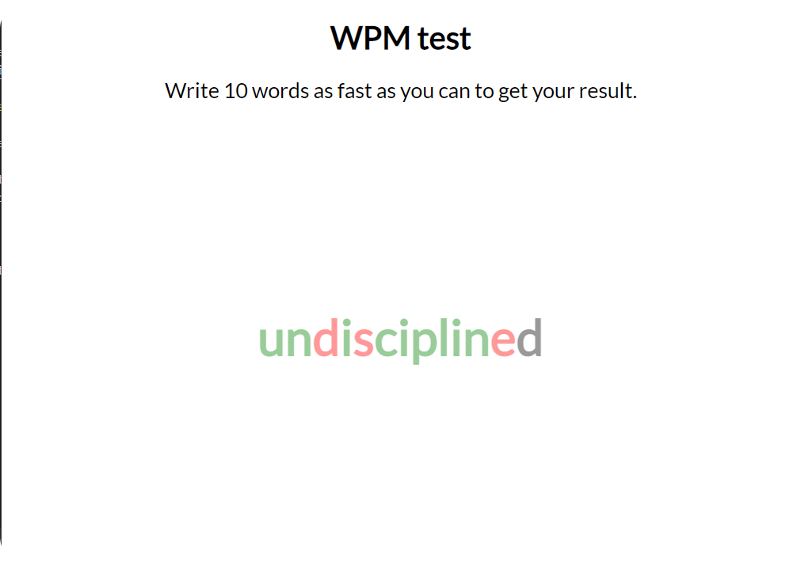
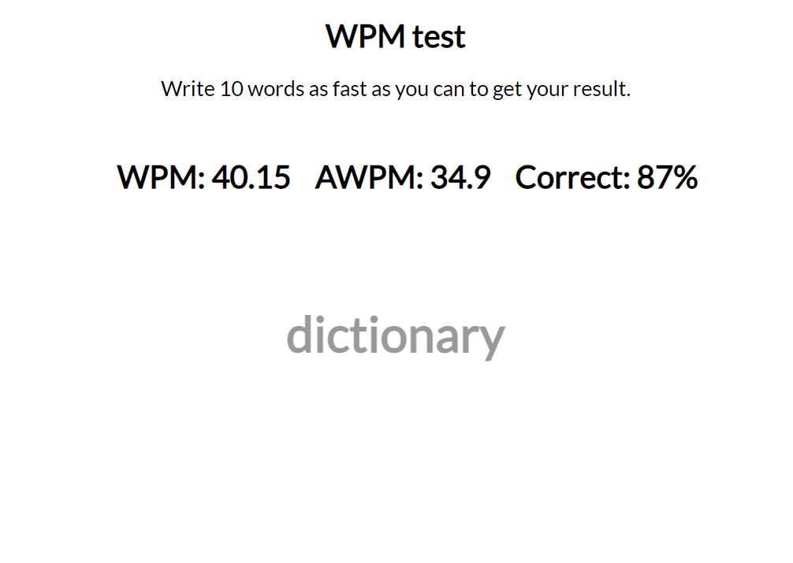

# WPM Test

## About

WPM Test is a simple desktop app that let you check your wpm (typing speed - words per minute), 
buit in [Wails](https://wails.io/) (golang) and [React](https://en.reactjs.org/) on frontend.
***



<br/>

## Requirements:
1. [Go](https://go.dev/)
2. [Wails](https://wails.io/)
3. [Node](https://nodejs.org/en/)

<br/>

### Run:

```
wails dev 
```

### Build:

```
wails build
```
